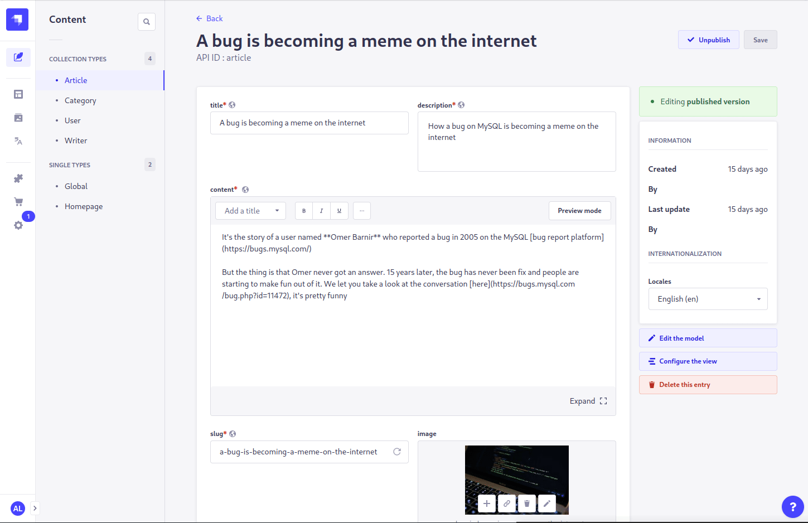

<p align="center">
  
</p>

# Strapi plugin DeepL

> This plugin is still a work in progress

This plugin integrates with the DeepL-API to provide quick automated translation of content fields.



## Setup

> Configuration is currently only possible using the plugin config file `config[/env]/plugins.js` or environment variables

```js
module.exports = {
  // ...
  deepl: {
    enabled: true,
    config: {
      // your DeepL API key
      apiKey: 'key',
      // whether to use the free or paid api, default true
      freeApi: true,
      // Which field types are translated (default string, text, richtext, components and dynamiczones)
      translatedFieldTypes: [
        'string',
        'text',
        'richtext',
        'component',
        'dynamiczone',
      ],
      // You can define a custom glossary to be used here (see https://www.deepl.com/docs-api/managing-glossaries/)
      glossaryId: 'customGlossary',
    },
  },
  // ...
}
```

or using the default environment variables:

- `DEEPL_API_KEY` - default `null`
- `DEEPL_API_FREE` - default `true`

To get an API key, register for free at [www.deepl.com/pro#developer](https://www.deepl.com/pro#developer).

## Features

- fill in and translate any locale from another already defined locale
- Configure which field types are translated
  - standard text fields and nested components by default
  - The translation of Markdown using DeepL works relatively well but is not perfect. Watch out especially if you have links in Markdown that could be changed by translation
  - uid fields are not translated by default because they might not result in the same translation as the attatched field -> saving is prevented in the conent manager anyway until you change the slug again
- Fields that are marked as not translated in the content-type settings will not be translated

## (Current) Limitations:

- Only the [deepl supported languages](https://www.deepl.com/docs-api/translating-text/request/) can be translated
- Only up to 50 text fields can be translated at once
- Relations are not translated
  - if the relation does not have internationalization enabled, the source relation is reused (unless this doesn't work with the cardinalities)
  - if the relation does have internationalization enabled, the source relation cannot be reused. It is hover not translated automatically (yet)

## TODOs

- [x] Ignore fields that are not translated
- [x] Ignore dates, enumeration, email, json
- [x] Allow translation of nested data
  - [x] components
  - [x] dynamic zones
- [ ] Configuration of free Api and token also through admin
- [ ] Overview of api usage in admin panel -> api done
- [ ] batch translation (needs to also 'translate' uids)
- [ ] translate relations as well
