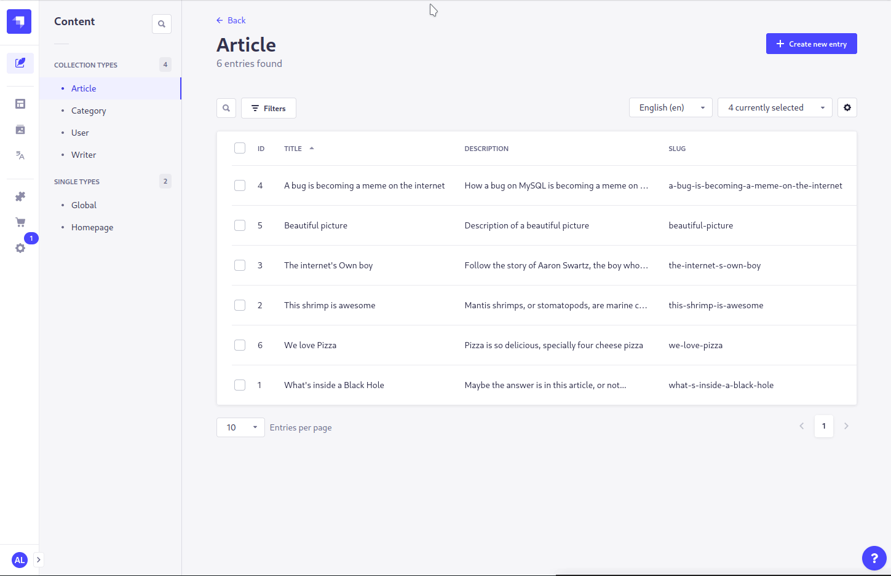

<p align="center">
  
</p>

<div align="center">
  <h1>Strapi v4 - Translate plugin</h1>
  <p>Manage and automate the translation of content fields.</p>
  <a href="https://www.npmjs.org/package/strapi-plugin-translate">
    
  </a>
  <a href="https://www.npmjs.org/package/strapi-plugin-translate">
    
  </a>
  <a href="https://github.com/Fekide/strapi-plugin-translate/actions">
    
  </a>
  <a href="http://commitizen.github.io/cz-cli/">
    
  </a>
</div>


## Requirements

This plugin requires the following, in order to work correctly:

- Strapi v4 (this plugin is not compatible with v3)
- The plugin **i18n** installed and enabled (`@strapi/plugin-i18n` [[npm](https://www.npmjs.com/package/@strapi/plugin-i18n)])
- The content type to have internationalization enabled (advanced settings in the content type builder)
- In the internationalization settings at least **two** locales
- A translation provider that executes the actual translation (see [Configuration](#configuration))

Unless you have the previous set up, the field on the right where you can translate will not show up. Also it will not show up when editing the currently only available translation of an entry.

## Installation

```bash
# with npm
$ npm install strapi-plugin-translate
# or with yarn
$ yarn add strapi-plugin-translate
```

After successful installation you have to build a fresh package that includes plugin UI:

```bash
# with npm
$ npm run build && npm run develop
# or with yarn
$ yarn build && yarn develop
```

## Configuration

### Overall plugin configuration

> The overall plugin configurtion is done through `config[/env]/plugins.js` or environment variables

```js
module.exports = {
  // ...
  translate: {
    enabled: true,
    config: {
      // Add the name of your provider here (for example 'deepl' for strapi-provider-translate-deepl or the full package name)
      provider: '[name]',
      providerOptions: {
        // Your provider might define some custom options like an apiKey
      },
      // Which field types are translated (default string, text, richtext, components and dynamiczones)
      // Either string or object with type and format
      // Possible formats: plain, markdown, html (default plain)
      translatedFieldTypes: [
        'string',
        { type: 'text', format: 'plain' },
        { type: 'richtext', format: 'markdown' },
        'component',
        'dynamiczone',
      ],
      // If relations should be translated (default true)
      translateRelations: true,
    },
  },
  // ...
}
```

#### Available providers

- [strapi-provider-translate-deepl](../providers/deepl/)

### Configure translation of individual fields/attributes

There are two options to configure translation of individual fields. Both are configured either in the Content-Type Builder in the admin interface in development mode, or in the `pluginOptions` property in the schema file.

#### Disable localization completely

This is part of the `i18n`-plugin and available in all field types except `relation`, `uid` under the name `Enable localization for this field`.

Set this value to false, and the field will not be translated. However it will be copied and have the same value for all localizations.

#### Configure behavior of automated translation

For the field types `component`, `dynamiczone`, `media`, `relation`, `richtext`, `string`, `text`, you can additionally configure the behavior when translating automatically under the name `Configure automated translation for this field?`. There are three options:

- `translate`: The field is automatically translated using the provider
- `copy`: The original value of the source localization is copied
- `delete`: The field is let empty after translation

> Relations are again little bit different. The `translate` option works as described [below](#schema-for-translating-relations), the `copy` option only works when the related content type is not localized and is one way or if bothWays is either `manyToOne` or `manyToMany`

> If you have other fields (e.g. custom fields) for which you want to configure the translation, this cannot be done through the Content-Type Builder, but only in the schema file:

```json
{
  //...
  "attributes": {
    //...
    "customField": {
      "type": "customField",
      "pluginOptions": {
        "translate": {
          "translate": "copy"
        },
        "i18n": {
          "localized": true
        }
      }
    }
    //...
  }
  //...
}
```

## Features

This plugin allows you to automatically translate content types. This can be done either on a single entity, or for all entities of a content type.

The following features are included:

- Fill in and translate any locale from another already defined locale
- Translation is restricted by permissions to avoid misuse of api quota
- Configure which field types are translated in the [plugin configuration](#configuration)
- Fields that are marked as not localized in the content-type settings will not be translated
- Components and Dynamic zones are translated recursively
- Relations are translated (if enabled in the [configuration](#configuration)) [if possible](#schema-for-translating-relations)

### Translate a single entity

- Open the entity that you want to translate
- Select a different (possibly unconfigured) locale in the `Internationalization` section on the right sidebar
- Click the link for `Translate from another locale` in the `Translate` section on the right sidebar
- Select the desired source to translate from
- Press the confirmation button

### Translate all entities of a content type



- Open the Translate plugin section in the left menu
- You now see an overview of all localized content types
- For each language and each content type you have 4 actions: `translate`, `cancel`, `pause` and `resume`. Most actions are disabled, since no job is running.
- Press the `translate` button, select the source locale and if already published entries should be published as well (Auto-Publish option)
- Start the translation.

Additional remarks:

- If a batch translation is running and the server is stopped, the translation will be resumed on a restart
- If entities are added after the starting the translation, they will not be translated
- UIDs are automatically translated in batch translation mode, since otherwise the entities could not be created/published
- If an error occurs, this will be shown in the logs or the message can be accessed by hovering over the `Job failed` badge

### Schema for translating relations

_The related objects are not translated directly, only the relation itself is translated_

#### the related content type **is localized**

- if a localization of the relation with the targetLocale exists -> it is used
- else the relation is removed

#### the related content type **is not localized**

- the relation goes both ways and would be removed from another object or localization if it was used (the case with oneToOne or oneToMany) -> it is removed
- otherwise the relation is kept

## Creating your own translation provider

A translation provider should have the following:

- be a npm package that starts with `strapi-provider-translate` and then your provider name (for example `google`)
- a main file declared in the package.json, that exports a provider object:

```js
module.exports = {
  provider: 'google',
  name: 'Google',
  /**
   * @param {object} providerOptions all config values in the providerOptions property
   * @param {object} pluginOptions all config values from the plugin
   */
  init(providerOptions = {}, pluginConfig = {}) {
    // Do some setup here

    return {
      /**
       * @param {{
       *  text:string|string[],
       *  sourceLocale: string,
       *  targetLocale: string,
       *  priority: number,
       *  format?: 'plain'|'markdown'|'html'
       * }} options all translate options
       * @returns {string[]} the input text(s) translated
       */
      async translate(options) {
        // Implement translation
      },
      /**
       * @returns {{count: number, limit: number}} count for the number of characters used, limit for how many can be used in the current period
       */
      async usage() {
        // Implement usage
      },
    }
  },
}
```

If your provider has some limits on how many texts or how many bytes can be submitted at once, you can use the `chunks` service to split it:

```js
const { chunks, reduceFunction } = strapi
  .service('plugin::translate.chunks')
  .split(textArray, {
    // max length of arrays
    maxLength: 100,
    // maximum byte size the request should have, if a single text is larger it is split on new lines
    maxByteSize: 1024 * 1000 * 1000,
  })
// The reduceFunction combines the split text array and possibly split texts back together in the right order
return reduceFunction(
  await Promise.all(
    chunks.map(async (texts) => {
      // Execute the translation here
      return providerClient.translateTexts(texts)
    })
  )
)
```

The translate function receives the format of the text as `plain`, `markdown` or `html`. If your translation provider supports only html, but no markdown, you can use the `format` service to change the format before translating to `html` and afterwards back to `markdown`:

```js
const { markdownToHtml, htmlToMarkdown } = strapi.service(
  'plugin::translate.format'
)

if (format === 'markdown') {
  return htmlToMarkdown(providerClient.translateTexts(markdownToHtml(text)))
}
return providerClient.translateTexts(texts)
```

## (Current) Limitations:

- The translation of Markdown and HTML may vary between different providers
- **Only super admins can translate**. This is currently the case, since permissions were added to the `translate` endpoint. Probably you can change the permissions with an enterprise subscription but I am not sure. If you know how to do that also in the community edition please tell me or open a merge request!
- Relations that do not have a translation of the desired locale will not be translated. To keep the relation you will need to translate both in succession (Behaviour for multi-relations has not yet been analyzed)

## Legal Disclaimer

Feki.de e.V. do not hold the copyright to the Logos of Strapi Inc. or DeepL SE. There is no cooperation or any other sort of affiliation between Feki.de e.V. and Strapi Inc. or DeepL SE. The Logos are used under fair use in order to not confuse Users as to what this plugin does.
